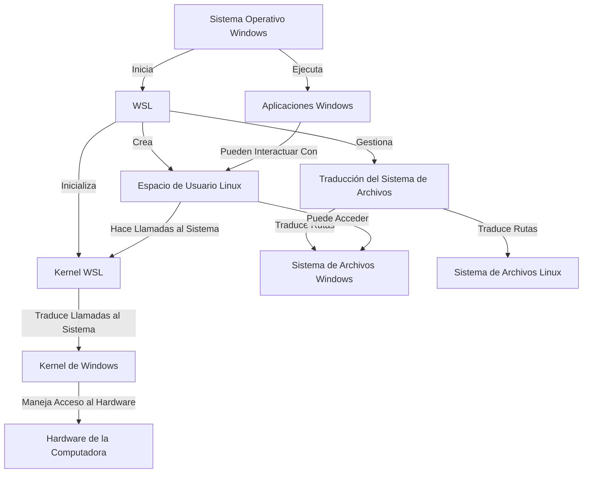

# Desarrollo en Linux dentro de Windows apto principiantes: WSL

Después de una vida teniendo que trabajar en Windows y Linux usando diferentes estrategias para manejar los distintos sistemas operativos (máquinas virtuales, dual boot, contenedores) les traigo la opción que venció a todas las anteriores para levantar un ambiente rápido y sobre todo fácil: Windows Subsystem for Linux.

Esto te va a ser útil si:
- Necesitás levantar un ambiente de desarrollo compatible con Linux desde Windows rápidamente y con buena performance.
- Querés aprender a usar Linux pero no te animas a instalar todo a mano en tu máquina.

## Un poco de historia

Los sistemas operativos se instalan en el disco. Normalmente solo se instala uno y queda funcionando en la máquina; después, no hace falta intervenir más. Ahora, lo más común es que, cuando uno arranca y quiere desarrollar en Linux, la primera opción sea instalar Linux sobreescribiendo y borrando Windows. Esta opción no es viable para alguien que está arrancando y no tiene la confianza de meter tanta mano en la compu, no le interesa, o comparte la computadora con otra gente. Aunque es una opción muy buena para una PC vieja o recuperada.

Después está la alternativa de tener los dos, y las opciones pasan a ser:

- El dual boot (dos SO, en el mismo o distintos discos duros). Esto hace que queden bien delimitados los sistemas operativos, a costo de una pequeña demora al prender la PC para seleccionar el sistema operativo a bootear.
- Usar un software de virtualización que crea una máquina virtual a la cual se le puede instalar el sistema operativo que uno desee. El sistema operativo de afuera le asigna recursos dedicados al sistema operativo de adentro, esto quiere decir, son recursos que dejan de estar disponibles para los otros programas que corra el sistema padre. 

Ambos se pueden hacer, pero no suelen ser muy fáciles de levantar para alguien que está arrancando. 

La contra del primero es que dependiendo del HW uno puede renegar un poco con la configuración, sobre todo si se tiene un solo disco para que convivan los dos SO. Y después, demora un ratito más en encender la PC si es algo que te molesta. 

La contra del segundo es que la máquina virtual tiene menos performance que la del sistema operativo padre y puede llevar tiempo de instalar y configurar los recursos compartidos entre sistemas. Si tiene como positivo la portabilidad que dan los backups de máquinas virtuales, aunque ocupen bastante disco. 

Ahora, de alguna de estas dos opciones uno no safaba... hasta que en 2016 aparece la primer version de Windows Subsystem for Linux. Yo me encontré con esta solución más o menos en 2020, cuando ya estaba la versión 2, con algunas funcionalidades extras y mejor performance que el WSL clásico.

Después de haber probado todas esas opciones, no tengo dudas de que actualmente, es la mejor forma para levantar ambientes de desarrollo para principiantes y no tan principiantes que quieren sacar un ambiente de desarrollo rápido desde una instalación nueva de Windows.

## ¿Cómo funciona?

Te lo muestro con el siguiente gráfico:

## ¿Cómo se instala?

Para versiones de Windows nuevas, el setup es bastante directo. Usando la [documentación oficial](https://learn.microsoft.com/es-es/windows/wsl/setup/environment), te explico el paso a paso:

1. Abrir PowerShell y ejecutar wsl --install

2. Abrir Ubuntu. Poner un nombre de usuario y contraseña para el sistema operativo Linux. Si es tu compu del día a día no hace falta algo tan complejo, sobre todo la password. 

En teoría esos pasos nos dejan con la máquina corriendo dentro de nuestro Windows. Estamos listos para usarlo.

## ¿Cómo se usa?

### Acceso por terminal

Desde PowerShell, ahora podemos abrir una nueva pestaña en la cual seleccionamos el sistema operativo al que queremos acceder. 

En una terminal ejecutamos programas, el equivalente al doble click en un ícono desde la interfaz visual. Es una interfaz puramente escrita de un nivel más bajo. Dentro de PowerShell se ejecutan programas de Windows dentro de Windows, mientras que en la terminal de Ubuntu, Debian o cualquier otro sistema instalado, se ejecutan programas de Linux en su respectivo entorno que corre dentro del sistema.

### Integración automática con VSCode

En mi opinión, la mejor funcionalidad es la posibilidad de abrir VSCode desde el sistema operativo principal (Windows), que se conecta y trata como un servidor remoto a WSL. En criollo, se conecta automáticamente y todo archivo que modifiques o código que ejecutes o compiles se realiza dentro de WSL, pero la interfaz visual sigue estando en el Windows. Anda más rápido. 

Para abrir un directorio en VSCode desde la terminal, basta con ejecutar *code .* dentro del directorio de WSL sobre el que queremosdesarrollar. Esto significa "Ejecuta el programa `code` dentro del directorio actual (representado por el .)".

### ¿Dónde están todos los archivos?

Desde el explorador de Windows se pueden encontrar todos los archivos del sistema operativo recién instalado. Para abrir el directorio actual de Linux desde la terminal de Ubuntu, por ejemplo, se puede ejecutar el comando *explorer.exe .*. Esto le dice a la compu: "Ejecutame el programa `explorer.exe` en el directorio actual (representado por el .)".

Fuentes:

- [Microsoft WSL](https://learn.microsoft.com/es-es/windows/wsl/)
- [Wikipedia WSL](https://en.wikipedia.org/wiki/Windows_Subsystem_for_Linux)