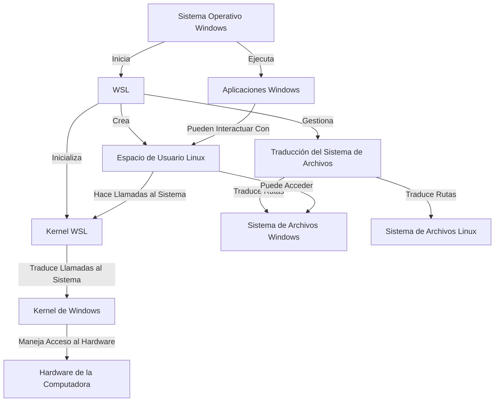

# Desarrollo en Linux dentro de Windows apto principiantes: WSL

Después de una vida teniendo que trabajar en windows y linux usando diferentes estrategias para manejar los distintos sistemas operativos (maquinas virtuales, dual boot, contenedores) hoy les traigo la que llegó para vencer todas las estrategias anteriores para levantar un ambiente rápido y sobre todo fácil: Windows Subsystem for Linux.

Esto te va a ser útil si:
- Necesitas levantar un ambiente de desarrollo compatible con linux desde windows rápidamente y con buena performance.
- Querés aprender a usar linux pero no te animas a instalar todo a mano en tu máquina.

## Un poco de historia

Los sistemas operativos se instalan en el disco. Normalmente solo se instala uno y queda corriendo en la máquina, despues no hace falta meter mas mano. Ahora lo mas común es que cuando uno arranca y quiere desarrollar en Linux la primera opción sea instalar linux pisando y borrando Windows. Opción que no es opción para alguien que esta arrancando y no tiene la confianza de meter tanta mano en la compu, o no le interesa, o comparte la computadora con otra gente. Aunque es una opción muy buena para una PC vieja o recuperada.

Después esta la alternativa de tener los 2, y las opciones pasan a ser:

- El dual boot (dos SO, en el mismo o distintos discos duros). Esto hace que queden bien delimitados los sistemas operativos, a costo de una pequeña demora al prender la PC para seleccionar el sistema operativo a bootear.
- Usar un software de virtualización que crea una máquina virtual a la cual se le puede instalar el sistema operativo que uno desee. El sistema operativo de afuera le asigna recursos dedicados al sistema operativo de adentro, esto quiere decir, son recursos que dejan de estar disponibles para los otros programas que corra el sistema padre. 

Ambos se pueden hacer, pero no suelen ser muy fáciles de levantar para alguien que esta arrancando. 

La contra del primero es que dependiendo del HW uno puede renegar un poco con la configuración, sobre todo si se tiene un solo disco para que convivan los 2 SO. Y depues, demora un ratito mas en encender la PC si es algo que te molesta. 

La contra del segundo es que la máquina virtual tiene menos performance que la del sistema operativo padre y puede llevar tiempo de instalar y configurar los recursos compartidos entre sistemas. Si tiene como positivo la portabilidad que dan los backups de máquinas virtuales, si bien ocupan bastante disco. 

Ahora, de alguna de estas 2 opciones uno no safaba.. Hasta que en 2016 aparece la primer version de Windows Subsystem for Linux. Yo me encontré con esta solución masomenos en 2020, cuando ya estaba la versión 2, con algunas funcionalidades extras y mejor performance que el WSL clásico.

Despues de haber probado todas esas opciones, no tengo dudas que hoy por hoy, es la mejor forma para levantar ambientes de desarrollo para principiantes y no tan principiantes que quieren sacar un ambiente de desarrollo rápido desde una instalación nueva de Windows.

## Y esto como funciona?

@startmermaid
pie title Pets adopted by volunteers
  "Dogs" : 386
  "Cats" : 85
  "Rats" : 35
@endmermaid

<pre class="mermaid">
graph TD
    A[Sistema Operativo Windows] -->|Inicia| B[WSL]
    B -->|Crea| C[Espacio de Usuario Linux]
    B -->|Inicializa| D[Kernel WSL]
    D -->|Traduce Llamadas al Sistema| E[Kernel de Windows]
    C -->|Hace Llamadas al Sistema| D
    E -->|Maneja Acceso al Hardware| F[Hardware de la Computadora]
    B -->|Gestiona| G[Traducción del Sistema de Archivos]
    G -->|Traduce Rutas| H[Sistema de Archivos Windows]
    G -->|Traduce Rutas| I[Sistema de Archivos Linux]
    J[Aplicaciones Windows] -->|Pueden Interactuar Con| C
    C -->|Puede Acceder| H
    A -->|Ejecuta| J
</pre>

## Y esto como se instala?

Para versiones de windows nuevas, el setup es bastante directo. De la [documentación oficial](https://learn.microsoft.com/es-es/windows/wsl/setup/environment) pongo el paso a paso explicado:

1. Abrir powershell y ejecutar wsl --install

2. Poner un nombre de usuario y pass para el sistema operativo linux. Si es tu compu del día a día no hace falta algo tan complejo, sobre todo la password. 

En teoría esos pasos nos dejan con la máquina corriendo dentro de nuestro windows. Estamos listos para pasar a usarlo.

## Y esto como se usa?

### Acceso por terminal
Desde Powershell, ahora podremos abrir un nuevo tipo de pestaña, en la cual seleccionamos el sistema operativo al cual queremos acceder que fue creado en el paso anterior. 

Dentro de una terminal uno ejecuta programas, el equivalente al doble click en un ícono desde la interfaz visual. Es una interfaz puramente escrita de un nivel mas bajo. En este caso dentro de Powershell se ejecutan programas de windows dentro de windows, y dentro de la terminal de Ubuntu, Debian o cualquier sistema instalado, se corren programas de Linux dentr de ese nuevo sistema que corre adentro.

### Integración con VSCode automática

La mejor funcionalidad en mi opinión es la posibilidad de abrir desde nuestro VSCode corriendo en el sistema operativo padre (Windows), que se conecta y trata como un servidor remoto a WSL. En criollo, se conecta automaticamente y todo archivo que modifique y código que ejecute o compile se hace dentro de WSL, pero la interfaz visual sigue estando en el Windows. Anda más rápido. 

Para abrir un directorio en VSCode desde la terminal, basta con correr *code .* dentro del directorio de WSL sobre el que queremos desarrollar. Esto significa "Ejecutame el programa code dentro del directorio actual (representado por el .)"

### Donde están todos los archivos?

Dese el explorador de windows se pueden encontrar todos los archivos del sistema operativo recién instalado. Para abrir el directorio actual de Linux en desde la terminal de Ubuntu por ejemplo, se puede ejecutar el comando *explorer.exe .*. Esto quiere decir, le decimos a la compu: "Ejecutame el programa explorer.exe en el directorio actual (representado por el .)".

Fuentes:

- [Microsoft WSL](https://learn.microsoft.com/es-es/windows/wsl/)
- [Wikipedia WSL](https://en.wikipedia.org/wiki/Windows_Subsystem_for_Linux)